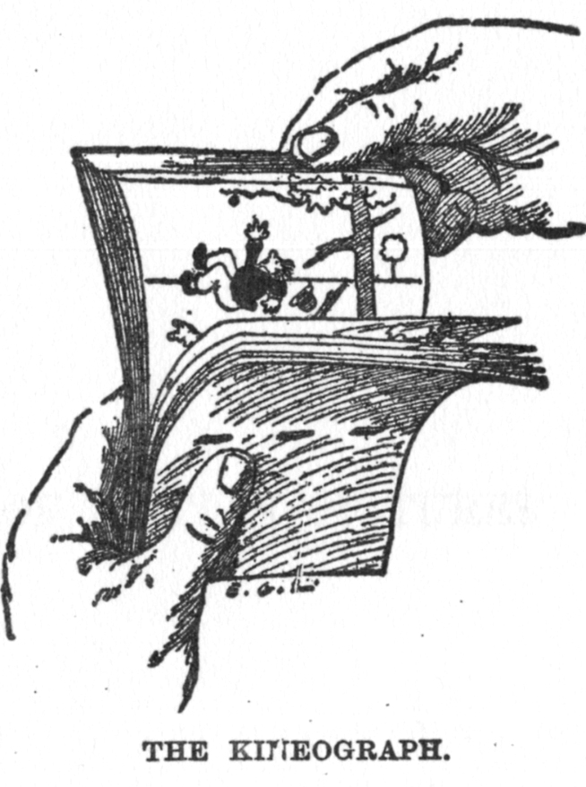
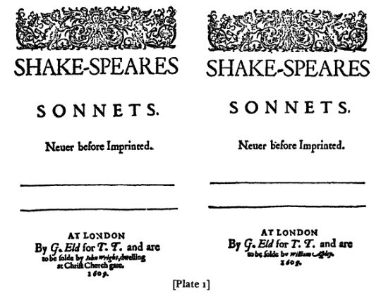
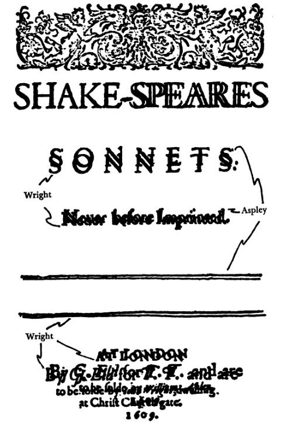

<!-- Good afternoon -->
<!-- My name is Gina Reynolds and I'm here today to talk to you about flipbooks and a new package to help you build them, {flipbookr} international word cloud? -->
<!-- Traditional flipbooks let users observe the evolution of a scene, by leafing through it's pages at their own pace. -->



<!-- The new *code* flipbooks I'm presenting on today, similarly allow users to observe the evolution --- of a code pipeline alongside the resulting output. -->

<!-- In our new flipbooks, code is presented alongside its output in incremental steps.   -->


During this talk I'm going to show you how you can build a flipbook in five minutes using the flipbookr package and the Rmarkdown slide show tool, Xaringan.

I'll show you three modalities for revealing your code incrementally.

And three modalities for diplaying the evolution.

Then, I'll point out the diversity of use cases that flipbooking applies to.

In the second part of the talk, I'll try to articulate just why this tool is valuable as a new communication device. 

# Demo

Quick sidebar: 

*Slowggplot*'s *l*iterally *o*nly *w*onderful *ggplot*

Principles: Working as incrementally as possible and ordering code such that you get feedback with each ggplot statement.  


--

# Value of Tool

# Presenting smaller steps


- less mental gymnastics (for familiar folks)

--

- less guesswork (for newcomers)

--

- reminders and reassurance (for the infrequent user)


---

# Okay, but why flipping?  


--

Why not infinitely scrolling through steps?


--

Why do we prefer *temporal* offset over than *spatial* offset?


---

# superimposition makes differencing easy...

```{r collator, fig.cap="'Carlton Hinman's mechanical collater and its adaptations have revolutionized collation.' (Randall McLeod - 1979)", out.width="80%"}
knitr::include_graphics("https://upload.wikimedia.org/wikipedia/commons/0/0e/Hinman_collator.jpg")
```

---

```{r, out.width="80%"}

```

---


```{r, out.width="50%"}

```


---

```{r blink, fig.cap="Blink Comparator helped discover Pluto, toggling between two aligned images and noticing what moved", out.width="80%"}
knitr::include_graphics("https://www.sightsize.com/wp-content/uploads/2015/08/Classic-ZEISS-Blink-Comparator.jpg")
```


---

```{r}
knitr::include_graphics("https://upload.wikimedia.org/wikipedia/commons/d/d3/Global_LORRI_mosaic_of_Pluto_in_true_colour.jpg")
```


```{r pres_setup, include = F}
knitr::opts_chunk$set(echo = F, message = F, warning = F, comment = "", fig.retina = 3)
```


```{r xaringan_look_1, message = F, results = "hide"}
xaringanthemer::mono_accent(
  code_highlight_color = "rgba(255, 211, 0, .35)",
  base_color = "#03418A"
    )
```


<blockquote class="twitter-tweet"><p lang="en" dir="ltr">📈 I learned a lot doing this week&#39;s <a href="https://twitter.com/hashtag/TidyTuesday?src=hash&amp;ref_src=twsrc%5Etfw">#TidyTuesday</a>. I had to make the axes and the lines connecting the points look hand-drawn (it takes some jittering!), and learn how to put a figure in the background. Happy with the result! Code below.<a href="https://twitter.com/hashtag/dataviz?src=hash&amp;ref_src=twsrc%5Etfw">#dataviz</a> <a href="https://twitter.com/hashtag/rstats?src=hash&amp;ref_src=twsrc%5Etfw">#rstats</a> <a href="https://twitter.com/hashtag/ggplot2?src=hash&amp;ref_src=twsrc%5Etfw">#ggplot2</a> <a href="https://twitter.com/R4DScommunity?ref_src=twsrc%5Etfw">@R4DScommunity</a> <a href="https://t.co/Gr0w37pbt9">pic.twitter.com/Gr0w37pbt9</a></p>&mdash; Gil Henriques 🌹 (he/him/his) (@_Gil_Henriques) <a href="https://twitter.com/_Gil_Henriques/status/1166373844040335360?ref_src=twsrc%5Etfw">August 27, 2019</a></blockquote> <script async src="https://platform.twitter.com/widgets.js" charset="utf-8"></script>


---


---

``` r
# 2019, August 27 - Gil J. B. Henriques
# TidyTuesday: https://github.com/rfordatascience/tidytuesday/tree/master/data/2019/2019-08-27

library(tidyverse)
library(showtext) # for google fonts

font_add_google("Gaegu", "gaegu")
showtext_auto()


# Read and prepare data ---------------------------------------------------
df <- read_delim("https://raw.githubusercontent.com/rfordatascience/tidytuesday/master/data/2019/2019-08-27/simpsons-guests.csv", delim = "|", quote = "")
df2 <- df %>% mutate(number = strsplit(as.character(number), "; ")) %>% 
  unnest() %>% # Splits rows that contain multiple episodes into multiple rows
  group_by(season) %>% summarize(guests_per_episode = n_distinct(guest_star)/n_distinct(number))


# Prepare for plot --------------------------------------------------------
# I want the axes and the line connecting the points to look hand-drawn, so I will use geom_line + jitter to draw them
spline_int <- as.data.frame(spline(as.numeric(df2$season), df2$guests_per_episode, method = "natural"))
x.ax <- data.frame(x = seq(from = 0, to = 30, by = 1), y = rep(0, 31))
y.ax <- data.frame(x = rep(0, 21), y = seq(from = 0, to = 4, by = 0.2))

# Plotting ----------------------------------------------------------------
windows()
plot <- df2 %>% 
  ggplot(aes(x = as.numeric(season), y = guests_per_episode)) + 
  geom_point(size = 4, color = "white") + 
  theme_void() + 
  theme(text = element_text(family = "gaegu"),
        axis.text = element_text(size = 15, color = "white"),
        axis.title = element_text(size = 20, color = "white"),
        plot.title = element_text(size = 25,face = "bold", color = "white", hjust = 0.5),
        plot.caption = element_text(color = "white"),
        plot.margin = margin(t = 1, r = 3, b = 1, l = 1, "cm"),
        axis.title.y = element_text(angle = 90)) + 
```

---


```{r owl}
knitr::include_graphics("http://stat545.com/img/how-to-draw-an-own-imgur.jpg")
```


---

"If all the steps are known and recorded there, can't we present them as steps?"


---

```{r}
knitr::include_url("https://evamaerey.github.io/tidytuesday_walk_through/simpsons.html#8")
```

---


# What are Flipbooks?


--

code and output

--

presented side-by-side

--

with evolutionary states incrementally superimposed

--

via automated parsing and reconstruction


---

# Incrementalism

- move back and forward, at own pace
- identify unfamiliar pieces


---

# less visual search ...

... because visual search requires attention/concentration

```{r spot, out.width="50%", fig.cap="", out.width="80%"}
knitr::include_graphics("https://upload.wikimedia.org/wikipedia/commons/0/0a/Spot_the_difference.png")
```

<!-- Lateral comparison is hard; superimposed temporal comparison is easy; Consider the \"spot the differences\" games. Imagine if these images were super imposed.  Flickering back and forth between the two of them, superimposed and aligned, and with changes made incrementally (one-by-one), the challenge would be taken out of the game. -->

---

# less visual search ...

```{r wally, out.width="130%"}
knitr::include_graphics("https://static.independent.co.uk/s3fs-public/thumbnails/image/2011/11/12/19/48-Where's-Wally-WALKER-BOOKS.jpg?w968")
```


---

# Motion detection is easy...

... even for anphibians

<blockquote class="twitter-tweet"><p lang="en" dir="ltr">Grant: &quot;Don’t move! It can’t see us if we don’t move.&quot; <a href="https://twitter.com/hashtag/JurassicPark?src=hash&amp;ref_src=twsrc%5Etfw">#JurassicPark</a> <a href="https://t.co/KtSdZWdq3d">pic.twitter.com/KtSdZWdq3d</a></p>&mdash; Jurassic Park Quotes (@JurassicPQuotes) <a href="https://twitter.com/JurassicPQuotes/status/818931155818938368?ref_src=twsrc%5Etfw">January 10, 2017</a></blockquote> <script async src="https://platform.twitter.com/widgets.js" charset="utf-8"></script>


---

```{r move}
knitr::include_url("https://www.youtube.com/watch?v=NOs116aoyo0http://archives.evergreen.edu/webpages/curricular/2011-2012/m2o1112/web/amphibians.html#Motion_Detection")
```


---

# Admitting to guess work...

<blockquote class="twitter-tweet"><p lang="en" dir="ltr">Raise your hand if you learned to code by copy-pasting stuff from the internet and changing it until it broke. 🖐</p>&mdash; Thomas J. Leeper (@thosjleeper) <a href="https://twitter.com/thosjleeper/status/1147840011125100544?ref_src=twsrc%5Etfw">July 7, 2019</a></blockquote> <script async src="https://platform.twitter.com/widgets.js" charset="utf-8"></script>

--

<!-- jhbadger comment on Hacker News:  -->

ggplot2 user:  It's easy to just find some code on the Web for a graph similar to what you want and tweak it for your data. ... The trick is to **really understand what each clause is doing**. 


---
 
# So, how is a flipbook built?

User creates an input code that can be broken into steps

```{r load_tidyverse, echo = F}
library(tidyverse)
```


```{r the_cars, echo = T, eval = F, fig.height=5}
cars %>%  # the data 
  filter(speed > 4) %>% 
  ggplot() +  # begin plot   
  aes(x = speed) +
  aes(y = dist) + 
  # geometric lyr
  geom_point(
    alpha = .3, 
    color = "blue" 
    ) + 
  aes(size = speed) 
```

---

# id of *lines* of code is given

```{r, echo = F}
library(flipbookr)
```


```{r}
flipbookr::chunk_code_get("the_cars") %>% 
  parse_code() %>% 
  select(line, raw_code)
```


---

# parses code

```{r}
chunk_as_text("the_cars") %>% 
  parse_code() %>% 
  select(code, connector, comment) 
```


---

# calculate break points

```{r}
chunk_as_text("the_cars") %>% 
  parse_code() %>% 
  select(code, connector, comment, auto) 
```

---

# create the partial code to present sequentially


```{r, echo = F}
flipbookr::partial_chunk(chunk_name = "the_cars", 1, 1)
```

--

```{r, echo = F}
flipbookr::partial_chunk(chunk_name = "the_cars", 1:2, 2)
```

--

```{r, echo = F}
flipbookr::partial_chunk(chunk_name = "the_cars", 1:3, 3)
```


<!-- --- -->

<!-- # ... using the `partial_chunk()` function   -->

<!-- ```{r what_partial_chunk, eval = F, echo = T} -->
<!-- flipbookr::partial_chunk( -->
<!--   chunk_name = "the_cars", # point to input chunk by name  -->
<!--   which_show = 1:5, # what lines should be shown #REVEAL2 -->
<!--   which_highlight = 5, # what lines should be highlighted #REVEAL3 -->
<!--   reg_assign = FALSE # is regular assignment is used #REVEAL4 -->
<!--   ) -->
<!-- ``` -->

<!-- r flipbookr::reveal("what_partial_chunk", display_type = "code", break_type = "non_seq")` -->


---

# create instructions...  

... to present each partial code snippet and output side by side as frames

--

... an example with Xaringan

```{r part_code}
return_partial_side_by_side_code_output_chunks("the_cars")
```


---

# Use instructions to build flipbook. Voila! A flipbook is born...

... on the next slide

---

`r flipbookr::reveal("the_cars")`

---


```{r download}
# download.file(url = "https://raw.githubusercontent.com/EvaMaeRey/flipbookr/master/inst/rmarkdown/templates/template-name/skeleton/skeleton.Rmd",
#               destfile = "skeleton.Rmd")
```


---

# Is there a package for that?

--

- Yes! flipbookr is available on github.

To install: 

``` r
devtools::install_github("EvaMaeRey/flipbookr")
```


---

# Flipbooking with flipbookr and Xaringan

--

- Create a new Xaringan document (you can do this from the template in flipbookr)

--

- load the flipbookr library


```{r echo = T}
library(flipbookr)
```

---

# Create an code chunk to flipbookify


````markdown
`r ''````{r cars, echo = F, eval = F}
cars %>%             # the data 
  filter(speed > 4) %>%  # subset
  ggplot() +              # pipe to ggplot
  aes(x = speed) +
  aes(y = dist) + #REVEAL
  # Describing what follows
  geom_point(
    alpha = .3, #REVEAL2
    color = "blue" #REVEAL3
    ) + #REVEAL
  aes(size = speed) #REVEAL
``
````

---

# use flipbook::reveal() flipbook this code!


<!-- The above is for the html output version, just look at the examples below if you are in the source! -->
```markdown
``r "r flipbook::reveal(chunk_name = \"cars\")"``
``` 

---


# flipbook modalities

There are several modalities that you might be interested in using for "flipbookifying" your code and the next section is dedicated to demoing some of them below.


- **break type** -- *which lines of code should be revealed when*, `break_type` defaults to "auto"

--

- **display type** -- *display code and output, or just output, or just code?*, `display_type` defaults to "both"

--

- **assignment type** -- *does code chunk use regular assignment?*, `reg_assign` defaults to FALSE


```{r cars, echo = F, eval = F, fig.height=5}
cars %>%             # the data 
  filter(speed > 4) %>%  # subset
  ggplot() +              # pipe to ggplot
  aes(x = speed) +
  aes(y = dist) + #REVEAL
  # Describing what follows
  geom_point(
    alpha = .3, #REVEAL2
    color = "blue" #REVEAL3
    ) + #REVEAL
  aes(size = speed) #REVEAL
```

---

# `break_type`


Notice the regular comments and the special #REVEAL comments, these will be used for a couple of the different "break type" modalities.


```{r, code = knitr::knit_code$get("cars"), eval = F, echo = T}
```

<!-- Also notice how we've created a new code chunk with the code from the previous chunk. -->
<!-- This slide is also about giving you some intuition about how flipbooking works in the background. -->
<!-- (more on this [here](https://emitanaka.rbind.io/post/knitr-knitr-code/)) -->


---

## break_type = "auto"

One parameter of flipbooking is the break_type.  The default is "auto", in which appropriate breakpoints are determined automatically --- by finding where parentheses are balanced. 

---

`r reveal("cars", break_type = "auto")`

---

## break_type = "user"

If the break_type is set to "user", the breakpoints are those indicated by the user with the special comment #REVEAL

```{r, code = knitr::knit_code$get("cars"), eval = F, echo = T}
```


---

`r reveal("cars", break_type = "user")`

---

## break_type = "non_seq"

If the break_type is set to "non_seq", the breakpoints are those indicated by the user with the special numeric comment #REVEAL2, #REVEAL3 etc to indicate at which point in time the code should appear.  

```{r, code = knitr::knit_code$get("cars"), eval = F, echo = T}
```


---

`r reveal("cars", break_type = "non_seq")`


---

## `break_type = 5` *(or entering the multiverse)*

<!-- Another modality is to set break_type equal to a positive integer, indicating that you want the same code chunk to be displayed multiple times. This makes the most sense in a setting where there is some randomization or random sampling and you want to see different realizations. Let's see this used on the user input code chunk "cars_multi", whose first step is to randomly sample rows from the data set cars with replacement. -->


```{r cars_multi, echo = T, eval = F, fig.height=5}
cars %>% 
  sample_frac(size = 1, replace = T) %>%      
  ggplot() +              
  aes(x = speed) +
  aes(y = dist) +
  geom_count(
    alpha = .3,
    color = "blue" 
    ) + 
  geom_smooth(method = lm, se = F) +
  coord_cartesian(xlim = range(cars$speed),
                  ylim = range(cars$dist)) +
  theme(legend.position = c(.9, .2))
```


---

`r reveal("cars_multi", break_type = 3)`


---

# `display_type`

- both
- output
- code


<!-- There are also different display modalities.  Namely you can indicate if you want "both" the code and the output displayed in your flipbookification, or just the "output" (perhaps to be used in a traditional presentation), or just the "code" (which might be used to kind of test student expectations about some code).  You have already seen the default where the parameter display_type is set to "both", but let's have a look at "output" and "code" only. -->

---

## `display_type = "output"`

Let's look at where only the *output* is displayed for the "cars" code chunk.


---

`r reveal("cars", break_type = "user", display_type = "output")`

---

## `display_type = "code"`

And now where only the *code* is displayed for the "cars" code chunk.


---

`r reveal("cars", break_type = "auto", display_type = "code")`


---

# Assignment

If you want to create an object in your flipbooks, it is most "natural" to use [reverse assignment](https://stat.ethz.ch/R-manual/R-devel/library/base/html/assignOps.html).  

<!-- Working sequentially with a pipeline of code, you get feedback all along the way until you get to the point of assigning all of what you have done to a new object with reverse assignment.  With regular assignment in R, you don't get any feedback, so flipbooking prefers this step at the end of a pipeline, so we can enjoy all the nice feedback. So the parameter reg_assign is by default set to FALSE. -->


```{r, }
knitr::include_graphics("http://www.mechanicsofsport.com/snowboarding/graphics/setup/regular-goofy.jpg")
```


---


# `reg_assign = TRUE`


But, setting the reg_assign paramter to T and using regular assignment, you can still create a meaningful flipbook that gives you feedback.   When reg_assign = T, the first object that is created prints at the end of the derivative code chunks. 


---

`r reveal("reg_assign", break_type = "auto", display_type = "both", reg_assign = T)`


```{r reg_assign, echo = F, eval = F}
my_plot <- cars %>%   # the data  
  filter(speed > 4) %>%  # subset
  ggplot() +       # pipe to ggplot
  aes(x = speed) +
  aes(y = dist) +
  geom_point()
```


---

`r flipbookr::reveal("plot_object")`

```{r plot_object, eval = T, echo = F}
cars %>% 
  ggplot() +
  aes(x = speed) +
  aes(y = dist) +
  geom_point() ->
cars_plot
```


---


`r flipbookr::reveal("further_building")`

```{r further_building, echo = F, eval = F}
cars_plot +
  labs(x = "Speed (mph)") + 
  labs(y = "Stopping distance (ft)")
```


---

# Beyond the tidyverse

It is no surprise that Flipbooks are born in the context of the popularity of the tidyverse tools --- tools that are designed be be used in sequential pipelines and that give a satisfying amount of feedback along the way!

But base R techniques and other popular tools can certainly also be employed.  

---

# "chaining" by overwriting objects

---

`r flipbookr::reveal("reg_assign2", break_type = "auto", display_type = "both", reg_assign = T)`


```{r reg_assign2, echo = F, eval = F}
cars_mod <- cars
cars_mod$half_dist <- cars$dist / 2
names(cars_mod)[2] <- "distance"
cars_mod <- cars_mod[cars_mod$distance > 10,]
cars_mod <- cars_mod["distance"]
```


---

## using the .[] and .[[]] syntax with the migrittr pipe - %>%

Flipbooking can also be applied to logical indexing workflows if the steps are broken up using the %>% followed by .[] and .[[]].  Thus flipbooking can also be used with base R logical indexing and with the popular `data.table` package. 


---

`r flipbookr::reveal("dot_notation")`

```{r dot_notation, echo = F, eval = T}
cars %>% 
  .[cars$speed > median(cars$speed),] %>% 
  .["speed"] %>% 
  .[,1] ->
top_speeds
```

---


# Base R plotting

It has been a while since I've done much plotting with base R, but I think it is important to have an example or two. 

---

`r flipbookr::reveal("base_r_plotting")`

```{r base_r_plotting, echo = F, eval = F}
plot(cars, xlab = "Speed (mph)", 
     ylab = "Stopping distance (ft)",
     las = 1)
lines(lowess(cars$speed, cars$dist, 
             f = 2/3, iter = 3), 
      col = "red")
title(main = "the `cars` data")
title(sub = "Data is from Ezekiel's (1930) 'Methods of Correlation Analysis'.")
```


---

`r flipbookr::reveal("cars_anova")`

```{r cars_anova, eval = T, echo = F, fig.keep='none'}
## An example of polynomial regression
plot(cars, xlab = "Speed (mph)", 
     ylab = "Stopping distance (ft)",
    las = 1, xlim = c(0, 25))
seq(0, 25, length.out = 200) ->
  d
for (degree in 1:4) {
  model <- lm(dist ~ poly(speed, degree), 
           data = cars)
  lines(d, 
        predict(model, 
                data.frame(speed = d)), 
        col = degree)
}
```


---

# Sharing your flipbooks (html website)

- zip and ship
- get it on github
- flipbook mini coming soon - gif 

---

# Present

- me making lot of flipbooks

- educators making flipbooks for special occasions (workshops) with my messy script


---

# Near future

- more people building flipbooks regularly using flipbookr! 

---

# Future future


- Extension to other languages, py, stata, c++?

- hacking the jupytr notebook? 


---

# Thanks to Flipbookers

- Emi Tanaka
- Garrick Aden-Buie

At DU:

- Ryan
- Suraj
- Matt


---

# Critical infrastructures

Much gratitude for contributors authors of:

- xaringan
- remarkjs
- ggplot2
- magrittr
- getParseData
- glue
- cowplot


---


# Flipbooks wish you a Merry Christmas

... or sprucing up your random walk

```{r spruce_example}
knitr::include_url(url = "file://localhost/Users/evangelinereynolds/Google%20Drive/tiny_flipbooks/02_spruce_up_random_walk.html")
```


---


```{css, eval = TRUE, echo = F}
.remark-code{line-height: 1.5; font-size: 80%}
```


<!-- # What are their advantages (Don Norman, the Design of Everyday Things) -->
<!--  - natural mapping (matching code-output temporal changes) -->
<!--  - affordances (ease of use - motion detection, name) -->
<!--  - feedback (minimal changes mean that feedback is digestible) -->


<!-- # Extending the basic -->
<!--   # adding connectors, allowing code wrapping, using a parser (making it safe for human consumption) -->
<!--   # using %>% .[] - data.table -->
<!--   # Regular Assignment -->
<!--   # Non sequential reveal (not yet implemented) -->
<!--   # Traditional presentations -->
<!--   # Ensembles (not yet stable) -->
<!--   # python, C++ (not yet implemented) -->
<!--   # Visual Table of contents - "You do not need a slide for the Table of Contents!" -->
<!--   # Flipbook mini (not yet final) -->
<!-- # resources -->
<!--   # package -->
<!--   # flipbooks library (my uses) -->
<!--   # minimal examples -->
<!--   # video? -->
<!-- # caviots -->
<!--   # irreproducibility across platforms (fonts) -->
<!--   # not, supported by remark.js, not going to work -->
<!--   # may load slow (or not at all - leaflet) -->
<!-- # future... -->


