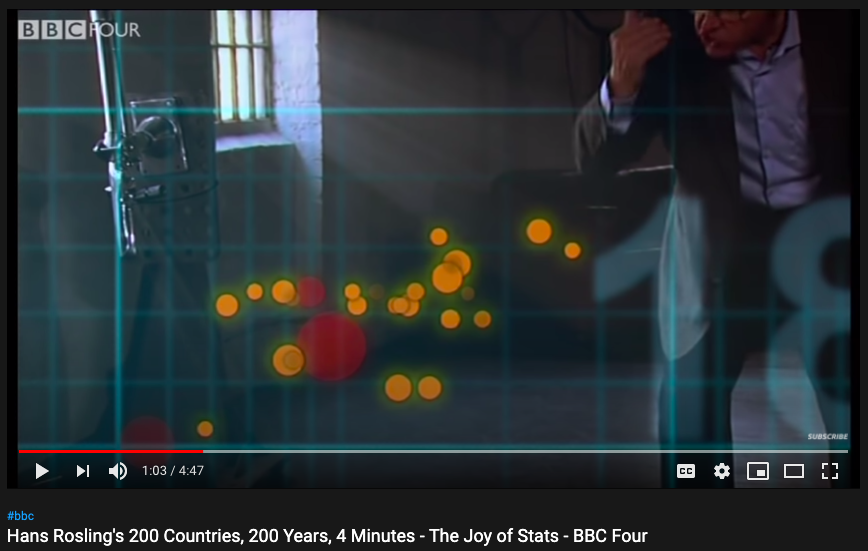
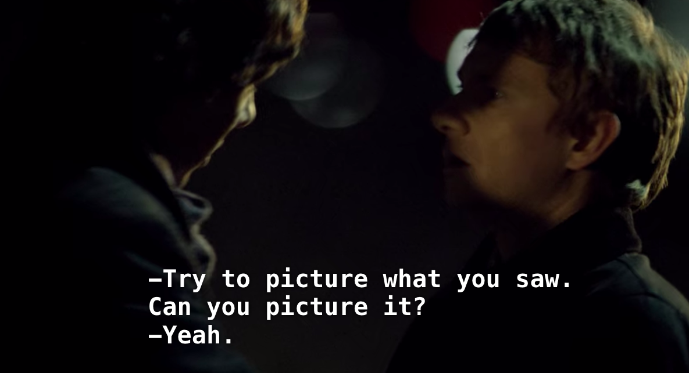
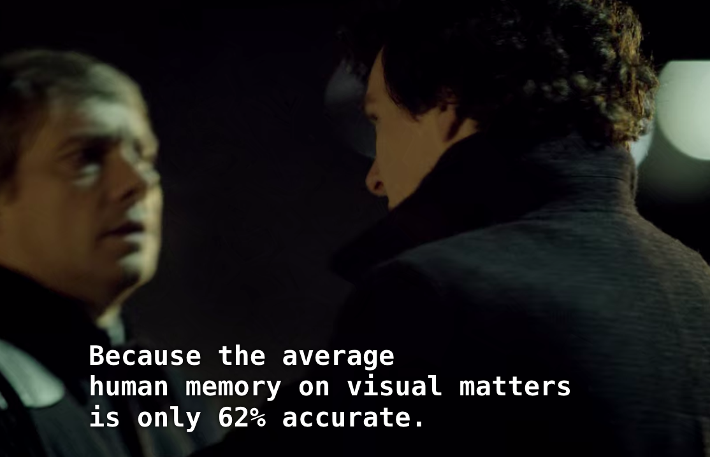

---
class: inverse

###From source .Rmd:

 ```{r, comment = '', echo = F, return = 'asis'}
cat('---
title: "Flipbooks"\nsubtitle: "with {flipbookr}"  \nauthor: "Evangeline \'Gina\' Reynolds"\ndate: \'No, 2020, 4pm\'\noutput:\n  xaringan::moon_reader:\n    lib_dir: libs\n    seal: false\n    nature:\n      ratio: 16:10\n      highlightStyle: github\n      highlightLines: true\n      countIncrementalSlides: false\n      beforeInit: "https://platform.twitter.com/widgets.js"')
```


---
class: inverse

###From source .Rmd:

 ```{r, comment = '', echo = F, return = 'asis'}
cat('---
\n\n```{r, include = F}\nknitr::opts_chunk$set(echo = F, comment = "", message = F, \n                      warning = F, cache = T, fig.retina = 3)\nlibrary(tidyverse)\nlibrary(flipbookr)\nlibrary(xaringanthemer)\n\nxaringanthemer::mono_light(\n  base_color = "#02075D",\n  # header_font_google = google_font("Josefin Sans"),\n  # text_font_google   = google_font("Montserrat", "200", "200i"),\n  # code_font_google   = google_font("Droid Mono"),\n  text_font_size = ".85cm",\n  code_font_size = ".15cm")\n\nmy_theme <- theme_get() + theme(text = element_text(size = 20))\ntheme_set(my_theme)\n```\n\n\n\n\nclass: right, top, inverse\nbackground-image: url(https://images.unsplash.com/photo-1541697418880-71a2ccd305a7?ixlib=rb-1.2.1&ixid=eyJhcHBfaWQiOjEyMDd9&auto=format&fit=crop&w=1050&q=80)\nbackground-size: cover\n\n# .Large[Flipbooks & {flipbookr}]\n\n## Evangeline "Gina" Reynolds\n\n#### Zurich Summer School for Women in Political Methodology\n\n#### November 27, 16:45\n\n#### github.com/EvaMaeRey/flipbookr\n???\n\nTitle slide\n\n')
```
---


```{r, include = F}
knitr::opts_chunk$set(echo = F, comment = "", message = F, 
                      warning = F, cache = T, fig.retina = 3)
library(tidyverse)
library(flipbookr)
library(xaringanthemer)

xaringanthemer::mono_light(
  base_color = "#02075D",
  # header_font_google = google_font("Josefin Sans"),
  # text_font_google   = google_font("Montserrat", "200", "200i"),
  # code_font_google   = google_font("Droid Mono"),
  text_font_size = ".85cm",
  code_font_size = ".15cm")

my_theme <- theme_get() + theme(text = element_text(size = 20))
theme_set(my_theme)
```


class: right, top, inverse
background-image: url(https://images.unsplash.com/photo-1541697418880-71a2ccd305a7?ixlib=rb-1.2.1&ixid=eyJhcHBfaWQiOjEyMDd9&auto=format&fit=crop&w=1050&q=80)
background-size: cover

# .Large[Flipbooks & {flipbookr}]

## Evangeline "Gina" Reynolds

#### Zurich Summer School for Women in Political Methodology

#### November 27, 16:45

#### github.com/EvaMaeRey/flipbookr
???

Title slide


---
class: inverse

###From source .Rmd:

 ```{r, comment = '', echo = F, return = 'asis'}
cat('---
name: me\nclass: bottom, right\nbackground-image: url(figures/me_bridge_woods.jpg)\nbackground-position: 5% 5%, 8% 60%\nbackground-size: 10%, 30%\n\n### teach: West Point\n### methods community: Denver RLadies\n### twitter: @EvaMaeRey\n### github: github.com/EvaMaeRey\n\n')
```
---
name: me
class: bottom, right
background-image: url(figures/me_bridge_woods.jpg)
background-position: 5% 5%, 8% 60%
background-size: 10%, 30%

### teach: West Point
### methods community: Denver RLadies
### twitter: @EvaMaeRey
### github: github.com/EvaMaeRey


---
class: inverse

###From source .Rmd:

 ```{r, comment = '', echo = F, return = 'asis'}
cat('---
name: traditional_flipbooks\nbackground-image: url(figures/dog_ball.gif)\nbackground-size: contain\n\n\n???\n\nJust as traditional flipbooks let users observe the evolution of a scene, by leafing through it\'s pages at their own pace ...\n')
```
---
name: traditional_flipbooks
background-image: url(figures/dog_ball.gif)
background-size: contain


???

Just as traditional flipbooks let users observe the evolution of a scene, by leafing through it's pages at their own pace ...


---
class: inverse

###From source .Rmd:

 ```{r, comment = '', echo = F, return = 'asis'}
cat('---
background-image: url(figures/racing_bar_flipbook.gif)\nbackground-size: contain\n\n\n???\n\n... new *code* flipbooks, allow users to observe the evolution of a code pipeline alongside the resulting output.\n\n')
```
---
background-image: url(figures/racing_bar_flipbook.gif)
background-size: contain


???

... new *code* flipbooks, allow users to observe the evolution of a code pipeline alongside the resulting output.


---
class: inverse

###From source .Rmd:

 ```{r, comment = '', echo = F, return = 'asis'}
cat('---
\n# Flipbooks...\n\n--\n\n## present code and output\n\n\n## side-by-side\n\n\n## and step-by-step\n')
```
---

# Flipbooks...

--

## present code and output


## side-by-side


## and step-by-step


---
class: inverse

###From source .Rmd:

 ```{r, comment = '', echo = F, return = 'asis'}
cat('---
\n## like a *stop-motion movie*\n--\n, based on someone actually building a code pipeline\n--\n, checking intermediate output states as they go\n\n\n--\n\n\n\n```{r}\nknitr::include_graphics("https://media.giphy.com/media/3mKBXLpYeLzUY/giphy.gif")\n```\n\n???\n\nAs flipbook builders, we choreograph a scene, and mostly stay out of the way. \nTry to make the action in the output tell the story, and go light on narrative (comments).\n\n')
```
---

## like a *stop-motion movie*
--
, based on someone actually building a code pipeline
--
, checking intermediate output states as they go


--


```{r}
knitr::include_graphics("https://media.giphy.com/media/3mKBXLpYeLzUY/giphy.gif")
```

???

As flipbook builders, we choreograph a scene, and mostly stay out of the way. 
Try to make the action in the output tell the story, and go light on narrative (comments).


---
class: inverse

###From source .Rmd:

 ```{r, comment = '', echo = F, return = 'asis'}
cat('---
\n## Inspired by ggplot2\n\n--\n\n## which I learned in the 2017 Summer School for Women in Political Methodology. \n\n--\n\n## liking last_plot() + ...  \n\n')
```
---

## Inspired by ggplot2

--

## which I learned in the 2017 Summer School for Women in Political Methodology. 

--

## liking last_plot() + ...  


---
class: inverse

###From source .Rmd:

 ```{r, comment = '', echo = F, return = 'asis'}
cat('---
\n# Layered presentation of graphics\n\n```{r, out.width="60%"}\nknitr::include_graphics("figures/blackwell_step_by_step_plot_build.png")\n```\n')
```
---

# Layered presentation of graphics

```{r, out.width="60%"}

```


---
class: inverse

###From source .Rmd:

 ```{r, comment = '', echo = F, return = 'asis'}
cat('---
\n```{r, out.width="50%"}\nknitr::include_graphics("figures/layered_presentation_of_graphics.png")\n```\n\n\n\n\n\n')
```
---

```{r, out.width="50%"}

```


---
class: inverse

###From source .Rmd:

 ```{r, comment = '', echo = F, return = 'asis'}
cat('---
\n# 2018: early flipbooks\n\n```{r, out.width="70%", fig.show="hold"}\nknitr::include_graphics("figures/garrick_proto_flipbook.png")\n```                        \n\n')
```
---

# 2018: early flipbooks

```{r, out.width="70%", fig.show="hold"}
knitr::include_graphics("figures/garrick_proto_flipbook.png")
```                        


---
class: inverse

###From source .Rmd:

 ```{r, comment = '', echo = F, return = 'asis'}
cat('---
\n# 2018: early flipbooks\n\n```{r, out.width="65%", fig.show="hold"}      \nknitr::include_graphics("figures/gina_proto_flipbook.png")\n```\n')
```
---

# 2018: early flipbooks

```{r, out.width="65%", fig.show="hold"}      
knitr::include_graphics("figures/gina_proto_flipbook.png")
```


---
class: inverse

###From source .Rmd:

 ```{r, comment = '', echo = F, return = 'asis'}
cat('---
\n# 2018: early flipbooks\n\n```{r, out.width="60%", fig.show="hold"} \nknitr::include_graphics("figures/emi_proto_flipbook.png")\n```\n\n@grrrck\n@evamaerey\n@statsgen\n')
```
---

# 2018: early flipbooks

```{r, out.width="60%", fig.show="hold"} 
knitr::include_graphics("figures/emi_proto_flipbook.png")
```

@grrrck
@evamaerey
@statsgen


---
class: inverse

###From source .Rmd:

 ```{r, comment = '', echo = F, return = 'asis'}
cat('---
\n## Hand-crafted, \n## Artisanal\n\n\n\n???\n\nIn 2018, the proto flipbook emerged on the Xaringan platform.  But each frame of the flipbook was individually crafted, which was kind of painstaking.  Garrick Aden-Buie created the first one I know of.  I created another one using SLOWggplot2 --- a totally incremental workflow.  Emi also embraced SLOWggplot2, styled the flipbook with her beautiful kunoichi and ninjutsu .css files and later partially automated flipbooking.\n\n\n\n\n\n\n')
```
---

## Hand-crafted, 
## Artisanal


???

In 2018, the proto flipbook emerged on the Xaringan platform.  But each frame of the flipbook was individually crafted, which was kind of painstaking.  Garrick Aden-Buie created the first one I know of.  I created another one using SLOWggplot2 --- a totally incremental workflow.  Emi also embraced SLOWggplot2, styled the flipbook with her beautiful kunoichi and ninjutsu .css files and later partially automated flipbooking.


---
class: inverse

###From source .Rmd:

 ```{r, comment = '', echo = F, return = 'asis'}
cat('---
\n\n\n\n\n# Do you want to build "flipbooks" together?\n\n\n???\n\nI wanted to collaborate with these brilliant like-minded people.  And they were game...  (I named  is exactly when flipbooks got their name too!)\n\n')
```
---


# Do you want to build "flipbooks" together?


???

I wanted to collaborate with these brilliant like-minded people.  And they were game...  (I named  is exactly when flipbooks got their name too!)


---
class: inverse

###From source .Rmd:

 ```{r, comment = '', echo = F, return = 'asis'}
cat('---
background-image: url(figures/moth_circling.jpg)\nbackground-size: contain\n\n???\n\nWe were kind of all circling around the idea - "flipbooks" had huge potential.  They could deliver a lot of insight about code behavior to their consumers. \n\n\n\n')
```
---
background-image: url(figures/moth_circling.jpg)
background-size: contain

???

We were kind of all circling around the idea - "flipbooks" had huge potential.  They could deliver a lot of insight about code behavior to their consumers. 


---
class: inverse

###From source .Rmd:

 ```{r, comment = '', echo = F, return = 'asis'}
cat('---
\n# Move to automate\n\n\n## *Automatically* parsing a block of input code \n\n--\n\n## *Automatically* reconstructing code into partial builds\n\n--\n\n## *Automatically* delivered on a presentation platform (here Xaringan)\n\n\n???\n\nAble to do this in large part because of the flexibility of knitr and rmarkdown documents!!!  Garrick and Emi are super expert and knew about some of the knitr secrets that few people know -- at that time the unexported function!  I love Emi\'s blogpost about this ...    \n\n\nBut to realize the full potential, creators needed to be unburdened from copy and paste. Flipbooks were a pain to build manually.  If you made a change in your vision of the overall pipeline, you might have to scrap all your work and start the whole annoying copy paste process again.  \n\n')
```
---

# Move to automate


## *Automatically* parsing a block of input code 

--

## *Automatically* reconstructing code into partial builds

--

## *Automatically* delivered on a presentation platform (here Xaringan)


???

Able to do this in large part because of the flexibility of knitr and rmarkdown documents!!!  Garrick and Emi are super expert and knew about some of the knitr secrets that few people know -- at that time the unexported function!  I love Emi's blogpost about this ...    


But to realize the full potential, creators needed to be unburdened from copy and paste. Flipbooks were a pain to build manually.  If you made a change in your vision of the overall pipeline, you might have to scrap all your work and start the whole annoying copy paste process again.  


---
class: inverse

###From source .Rmd:

 ```{r, comment = '', echo = F, return = 'asis'}
cat('---
class: inverse, center, middle\n\n```{r, out.width="40%"}\nknitr::include_graphics("figures/flipbook_sticker_britt.png")\n```\n\n')
```
---
class: inverse, center, middle

```{r, out.width="40%"}

```


---
class: inverse

###From source .Rmd:

 ```{r, comment = '', echo = F, return = 'asis'}
cat('---
\n## Remainder of talk:\n\n### 0. Prep for demo\n### 1. Let\'s build flipbooks\n### 2. Some additional modes\n### 3. Why Flipbooks?\n\n--\n\n## Background for Demo:\n\n### - R, Rmarkdown, Rstudio\n### - tidyverse + ggplot2\n\n')
```
---

## Remainder of talk:

### 0. Prep for demo
### 1. Let's build flipbooks
### 2. Some additional modes
### 3. Why Flipbooks?

--

## Background for Demo:

### - R, Rmarkdown, Rstudio
### - tidyverse + ggplot2


---
class: inverse

###From source .Rmd:

 ```{r, comment = '', echo = F, return = 'asis'}
cat('---
\n# Do I need to use any \'weird tricks\' to write code to be \'flipbooked\'?\n\n--\n\n# Yup.\n\n')
```
---

# Do I need to use any 'weird tricks' to write code to be 'flipbooked'?

--

# Yup.


---
class: inverse

###From source .Rmd:

 ```{r, comment = '', echo = F, return = 'asis'}
cat('---
\n\n## Aim for incremental, sequential workflow, where feedback is given at each step.\n\n--\n\n- ### Piped workflow\n\n  - %>%\n  - %>% + .\n  - %$%\n  \n\n\n--\n\n- ### right assignment -> instead of = or <- makes it easier to display output\n\n\n--\n  \n- ### ggplot pipelines - but SLOWggplot is recommended\n\n')
```
---


## Aim for incremental, sequential workflow, where feedback is given at each step.

--

- ### Piped workflow

  - %>%
  - %>% + .
  - %$%
  


--

- ### right assignment -> instead of = or <- makes it easier to display output


--
  
- ### ggplot pipelines - but SLOWggplot is recommended


---
class: inverse

###From source .Rmd:

 ```{r, comment = '', echo = F, return = 'asis'}
cat('---
\n\n```{r, out.width="80%"}\nknitr::include_graphics("figures/stop_motion.gif")\n```\n\n\n\n')
```
---


```{r, out.width="80%"}

```


---
class: inverse

###From source .Rmd:

 ```{r, comment = '', echo = F, return = 'asis'}
cat('---
background-image: url(figures/upsplash_yancy_min_snail.jpg)\nbackground-size: cover\n\n\n# **S**LOWggplot2\'s \n\n--\n# **L**iterally \n\n--\n# **O**nly \n\n--\n# **W**onderful  <br> (or **Wayward** <br> or **W**ayfairing)\n\n--\n# **ggplot2**\n\n\n???\n\nFor the demo, I\'m going to use a dialect of ggplot2.  Slowggplot2 is just ggplot.  It is fully supported and native.  \n\n')
```
---
background-image: url(figures/upsplash_yancy_min_snail.jpg)
background-size: cover


# **S**LOWggplot2's 

--
# **L**iterally 

--
# **O**nly 

--
# **W**onderful  <br> (or **Wayward** <br> or **W**ayfairing)

--
# **ggplot2**


???

For the demo, I'm going to use a dialect of ggplot2.  Slowggplot2 is just ggplot.  It is fully supported and native.  


---
class: inverse

###From source .Rmd:

 ```{r, comment = '', echo = F, return = 'asis'}
cat('---
background-image: url(figures/upsplash_yancy_min_snail.jpg)\nbackground-size: cover\n\nclass: middle\n\n# .large[incrementalism]\n\n--\n\n# .large[feedback]\n\n\n\n\n')
```
---
background-image: url(figures/upsplash_yancy_min_snail.jpg)
background-size: cover

class: middle

# .large[incrementalism]

--

# .large[feedback]


---
class: inverse

###From source .Rmd:

 ```{r, comment = '', echo = F, return = 'asis'}
cat('---
background-image: url(figures/upsplash_yancy_min_snail.jpg)\nbackground-size: cover\n\nclass: middle\n\n# .large[one ggplot <br> statement]\n--\n\n# .large[per decision]\n\n\n')
```
---
background-image: url(figures/upsplash_yancy_min_snail.jpg)
background-size: cover

class: middle

# .large[one ggplot <br> statement]
--

# .large[per decision]


---
class: inverse

###From source .Rmd:

 ```{r, comment = '', echo = F, return = 'asis'}
cat('---
\n\n# from some ggplot documentation\n\n# `+` is the key to constructing sophisticated ggplot2 graphics. It allows you to start simple, then get more and more complex, **checking your work at each step.**\n\n\n\n\n')
```
---


# from some ggplot documentation

# `+` is the key to constructing sophisticated ggplot2 graphics. It allows you to start simple, then get more and more complex, **checking your work at each step.**


---
class: inverse

###From source .Rmd:

 ```{r, comment = '', echo = F, return = 'asis'}
cat('---
\n`r flipbookr::chunk_reveal("fast_ggplot", display_type = "code")`\n\n\n```{r fast_ggplot, include = F}\nggplot(data = cars, \n       mapping = aes(x = speed, \n                     y = dist, \n                     col = dist)) +\n  geom_point() +\n  labs(x = "Speed (mph)",\n       y = "Distance (feet)",\n       title = "Speed v. Stopping ...")\n```\n\n\n\n\n')
```
---

`r flipbookr::chunk_reveal("fast_ggplot", display_type = "code")`


```{r fast_ggplot, include = F}
ggplot(data = cars, 
       mapping = aes(x = speed, 
                     y = dist, 
                     col = dist)) +
  geom_point() +
  labs(x = "Speed (mph)",
       y = "Distance (feet)",
       title = "Speed v. Stopping ...")
```


---
class: inverse

###From source .Rmd:

 ```{r, comment = '', echo = F, return = 'asis'}
cat('---
\n`r flipbookr::chunk_reveal("slow", display_type = "code")`\n\n\n```{r slow, include = F}\ncars %>% \n  ggplot() +\n  aes(x = speed) +\n  aes(y = dist) +\n  geom_point() +\n  aes(color = dist) +\n  labs(x = "Speed (mph)") +\n  labs(y = "Distance (feet)") +\n  labs(title = "Speed v. Stopping ...")\n```\n\n\n\n\n\n')
```
---

`r flipbookr::chunk_reveal("slow", display_type = "code")`


```{r slow, include = F}
cars %>% 
  ggplot() +
  aes(x = speed) +
  aes(y = dist) +
  geom_point() +
  aes(color = dist) +
  labs(x = "Speed (mph)") +
  labs(y = "Distance (feet)") +
  labs(title = "Speed v. Stopping ...")
```


---
class: inverse

###From source .Rmd:

 ```{r, comment = '', echo = F, return = 'asis'}
cat('---
\n\n# With {flipbookr}\n\n# You can build a flipbook five minutes...\n\n--\n\n# Let\'s do it!\n\n--\n\n# [Hans Rosling\'s 200 Countries, 200 Years, 4 Minutes - The Joy of Stats - BBC Four](https://www.youtube.com/watch?v=jbkSRLYSojo)\n\n\nhttps://www.youtube.com/watch?v=jbkSRLYSojo\n')
```
---


# With {flipbookr}

# You can build a flipbook five minutes...

--

# Let's do it!

--

# [Hans Rosling's 200 Countries, 200 Years, 4 Minutes - The Joy of Stats - BBC Four](https://www.youtube.com/watch?v=jbkSRLYSojo)


https://www.youtube.com/watch?v=jbkSRLYSojo


---
class: inverse

###From source .Rmd:

 ```{r, comment = '', echo = F, return = 'asis'}
cat('---
\n\n')
```
---


---
class: inverse

###From source .Rmd:

 ```{r, comment = '', echo = F, return = 'asis'}
cat('---
\n')
```
---


---
class: inverse

###From source .Rmd:

 ```{r, comment = '', echo = F, return = 'asis'}
cat('---
\n\n\n')
```
---


---
class: inverse

###From source .Rmd:

 ```{r, comment = '', echo = F, return = 'asis'}
cat('---
\n\n')
```
---


---
class: inverse

###From source .Rmd:

 ```{r, comment = '', echo = F, return = 'asis'}
cat('---
\n\n')
```
---


---
class: inverse

###From source .Rmd:

 ```{r, comment = '', echo = F, return = 'asis'}
cat('---
\n# "Having the data is not enough.  You have to show the data in ways that people enjoy and understand" - Hans Rosling\n\n\n\n')
```
---

# "Having the data is not enough.  You have to show the data in ways that people enjoy and understand" - Hans Rosling


---
class: inverse

###From source .Rmd:

 ```{r, comment = '', echo = F, return = 'asis'}
cat('---
\n# [Easy Flipbook Recipes](https://evamaerey.github.io/flipbooks/flipbook_recipes#1)\n\nhttps://evamaerey.github.io/flipbooks/flipbook_recipes#1\n\n--\n\n# Or RStudio -> File -> New File -> Rmarkdown -> A Minimal Flipbook\n\n\n\n???\n\nToday, you can build a flipbook in 5 minutes with the new package flipbookr.  \n\nDuring this talk I\'m going to show you how you can build a flipbook in five minutes using the flipbookr package and the Rmarkdown slide show tool, Xaringan.\n\nI\'ll show you three modalities for *revealing* your code incrementally (break_type)\n\nAnd three modalities for displaying this evolution. (display_type)\n\nThen, I\'ll make you aware of some of the diversity of use cases where flipbooking may be used.\n\nIn the second part of the talk, I\'ll try to articulate just why I think this tool is valuable as a new communication device, and valuable to add to your tool box.\n\n')
```
---

# [Easy Flipbook Recipes](https://evamaerey.github.io/flipbooks/flipbook_recipes#1)

https://evamaerey.github.io/flipbooks/flipbook_recipes#1

--

# Or RStudio -> File -> New File -> Rmarkdown -> A Minimal Flipbook


???

Today, you can build a flipbook in 5 minutes with the new package flipbookr.  

During this talk I'm going to show you how you can build a flipbook in five minutes using the flipbookr package and the Rmarkdown slide show tool, Xaringan.

I'll show you three modalities for *revealing* your code incrementally (break_type)

And three modalities for displaying this evolution. (display_type)

Then, I'll make you aware of some of the diversity of use cases where flipbooking may be used.

In the second part of the talk, I'll try to articulate just why I think this tool is valuable as a new communication device, and valuable to add to your tool box.


---
class: inverse

###From source .Rmd:

 ```{r, comment = '', echo = F, return = 'asis'}
cat('---
class: inverse, center, middle\n\n\n# More {flipbookr} modes\n')
```
---
class: inverse, center, middle


# More {flipbookr} modes


---
class: inverse

###From source .Rmd:

 ```{r, comment = '', echo = F, return = 'asis'}
cat('---
\n```{r, child = "flipbookr_rstudio_conf_suppliment.Rmd", eval = T}\n\n```\n\n\n\n\n')
```
---

```{r, child = "flipbookr_rstudio_conf_suppliment.Rmd", eval = T}

```


---
class: inverse

###From source .Rmd:

 ```{r, comment = '', echo = F, return = 'asis'}
cat('---
class: center, middle, inverse\n\n# .Large[Is it worth it?]\n\n\n???\n\nWe\'ve tried to make creating flipbooks easy for you.  But it is still a bit of extra effort.  So I want to go back to the topic of why it is a good communication tool.\n\n')
```
---
class: center, middle, inverse

# .Large[Is it worth it?]


???

We've tried to make creating flipbooks easy for you.  But it is still a bit of extra effort.  So I want to go back to the topic of why it is a good communication tool.


---
class: inverse

###From source .Rmd:

 ```{r, comment = '', echo = F, return = 'asis'}
cat('---
\n# when newcomers see a long pipeline of code ...\n\n--\n\n# No exit next 15 miles...\n\n')
```
---

# when newcomers see a long pipeline of code ...

--

# No exit next 15 miles...


---
class: inverse

###From source .Rmd:

 ```{r, comment = '', echo = F, return = 'asis'}
cat('---
class: bottom\nbackground-image: url(figures/owl.jpeg)\nbackground-size: 95%\nbackground-position: 60% 25%\n\n???\n\nThey may feel like this is the message\n\nbreaks down the steps with accompanying output, is something that newcomers have a better chance at following.\n\nEven for seasoned practicioner might not be familiar with all the pieces of a pipeline.  \n\nA seasoned user will probably manage to infer what an unfamiliar function or two are doing in a pipeline, but this requires a lot of mental gymnastics and concentration. \n\nFlipbooks allow people to narrow in on unfamiliar steps, looking what immediately preceeds and immediately follows.  To alleviate this burden. \n\n\n')
```
---
class: bottom
background-image: url(figures/owl.jpeg)
background-size: 95%
background-position: 60% 25%

???

They may feel like this is the message

breaks down the steps with accompanying output, is something that newcomers have a better chance at following.

Even for seasoned practicioner might not be familiar with all the pieces of a pipeline.  

A seasoned user will probably manage to infer what an unfamiliar function or two are doing in a pipeline, but this requires a lot of mental gymnastics and concentration. 

Flipbooks allow people to narrow in on unfamiliar steps, looking what immediately preceeds and immediately follows.  To alleviate this burden. 


---
class: inverse

###From source .Rmd:

 ```{r, comment = '', echo = F, return = 'asis'}
cat('---
\n\n# Okay, but what does *flipping* do for us?\n\n\n--\n\n\n## Why not infinitely scrolling through steps\n\n\n\n\n\n\n\n\n\n\n\n\n')
```
---


# Okay, but what does *flipping* do for us?


--


## Why not infinitely scrolling through steps


---
class: inverse

###From source .Rmd:

 ```{r, comment = '', echo = F, return = 'asis'}
cat('---
class: middle, center\n\n# i.e. what does *temporal* offset afford that *spatial* offset doesn\'t?\n')
```
---
class: middle, center

# i.e. what does *temporal* offset afford that *spatial* offset doesn't?


---
class: inverse

###From source .Rmd:

 ```{r, comment = '', echo = F, return = 'asis'}
cat('---
class: bottom\nbackground-image: url(figures/pie_scroll_comparison.gif)\nbackground-size: contain \n')
```
---
class: bottom
background-image: url(figures/pie_scroll_comparison.gif)
background-size: contain 


---
class: inverse

###From source .Rmd:

 ```{r, comment = '', echo = F, return = 'asis'}
cat('---
\n\n\n# Spatial offset \n\n--\n\n\n# requires us to engage in "visual search"\n\n--\n\n# which requires focused attention and concentration\n\n--\n\n# because it relies on visual memeory\n\n')
```
---


# Spatial offset 

--


# requires us to engage in "visual search"

--

# which requires focused attention and concentration

--

# because it relies on visual memeory


---
class: inverse

###From source .Rmd:

 ```{r, comment = '', echo = F, return = 'asis'}
cat('---
\n```{r, out.width="80%"}\nknitr::include_graphics("analogies_images/visual_memory.png")\n```\n\n')
```
---

```{r, out.width="80%"}

```


---
class: inverse

###From source .Rmd:

 ```{r, comment = '', echo = F, return = 'asis'}
cat('---
\n```{r, out.width="80%"}\nknitr::include_graphics("analogies_images/john_conenctrate.png")\n```\n')
```
---

```{r, out.width="80%"}
knitr::include_graphics("analogies_images/john_conenctrate.png")
```


---
class: inverse

###From source .Rmd:

 ```{r, comment = '', echo = F, return = 'asis'}
cat('---
\n\n```{r, out.width="80%"}\nknitr::include_graphics("analogies_images/visual_memory_2.png")\n```\n\n\n\n\n\n')
```
---


```{r, out.width="80%"}

```


---
class: inverse

###From source .Rmd:

 ```{r, comment = '', echo = F, return = 'asis'}
cat('---
\n\n```{r spot, out.width="50%", fig.cap="", out.width="90%", fig.align="center", fig.cap="Find ten differences..."}\nknitr::include_graphics("https://upload.wikimedia.org/wikipedia/commons/0/0a/Spot_the_difference.png")\n```\n\n\n???\n\nLateral comparison is hard; superimposed temporal comparison is easy; Consider the \"spot the differences\" games. Imagine if these images were super imposed.  Flickering back and forth between the two of them, superimposed and aligned, and with changes made incrementally (one-by-one), the challenge would be taken out of the game.\n\n\n')
```
---


```{r spot, out.width="50%", fig.cap="", out.width="90%", fig.align="center", fig.cap="Find ten differences..."}
knitr::include_graphics("https://upload.wikimedia.org/wikipedia/commons/0/0a/Spot_the_difference.png")
```


???

Lateral comparison is hard; superimposed temporal comparison is easy; Consider the \"spot the differences\" games. Imagine if these images were super imposed.  Flickering back and forth between the two of them, superimposed and aligned, and with changes made incrementally (one-by-one), the challenge would be taken out of the game.


---
class: inverse

###From source .Rmd:

 ```{r, comment = '', echo = F, return = 'asis'}
cat('---
class: top\nbackground-image: url(figures/toggle_pie.gif)\nbackground-size: contain\nbackground-position: bottom\n\n# A "Blink Comparator" type experience\n\n\n???\n\n\n\nThis contrasts to temporal offset.\nYou can see how a user might narrow in on unfamiliar bits, and toggling back and forth between the previous state and the new state.  It\'s a "blink comparator" type experience..\n\n\n')
```
---
class: top
background-image: url(figures/toggle_pie.gif)
background-size: contain
background-position: bottom

# A "Blink Comparator" type experience


???


This contrasts to temporal offset.
You can see how a user might narrow in on unfamiliar bits, and toggling back and forth between the previous state and the new state.  It's a "blink comparator" type experience..


---
class: inverse

###From source .Rmd:

 ```{r, comment = '', echo = F, return = 'asis'}
cat('---
background-image: url(figures/zeiss_blink_comparator.jpg)\nbackground-size: contain\n\n# Blink <br> Comparator \n\n\n???\n\nBlink Comparator, allowed researcher to toggle between two *superimposed* and *aligned* images, to allow you to and noticing what moved between different time periods -- the photos were of the night sky at different time points through a telescope\n\n\n\n\n')
```
---
background-image: url(figures/zeiss_blink_comparator.jpg)
background-size: contain

# Blink <br> Comparator 


???

Blink Comparator, allowed researcher to toggle between two *superimposed* and *aligned* images, to allow you to and noticing what moved between different time periods -- the photos were of the night sky at different time points through a telescope


---
class: inverse

###From source .Rmd:

 ```{r, comment = '', echo = F, return = 'asis'}
cat('---
background-image: url(figures/pluto_in_true_colour_wikipedia.jpg)\nbackground-size: cover\n\n\n\n\n???\n\nBlink Comparator -- is a proven technology -- most famously credited with humankind discovering Pluto decades earlier than we would have otherwise! \n\n\n\n')
```
---
background-image: url(figures/pluto_in_true_colour_wikipedia.jpg)
background-size: cover


???

Blink Comparator -- is a proven technology -- most famously credited with humankind discovering Pluto decades earlier than we would have otherwise! 


---
class: inverse

###From source .Rmd:

 ```{r, comment = '', echo = F, return = 'asis'}
cat('---
\n\n\n\nData visualization is "pre-attentively processing"\n\n--\n\nWe immediately and effortlessly notice patterns when data as visualized -- Cleveland \n\n--\n\nIt\'s easy to notice motion.  Detecting differences via "motion detection" is the experience flipbooks give us.  \n\n--\n\n- pretty effortless!!!\n\n--\n\n\n')
```
---


Data visualization is "pre-attentively processing"

--

We immediately and effortlessly notice patterns when data as visualized -- Cleveland 

--

It's easy to notice motion.  Detecting differences via "motion detection" is the experience flipbooks give us.  

--

- pretty effortless!!!

--


---
class: inverse

###From source .Rmd:

 ```{r, comment = '', echo = F, return = 'asis'}
cat('---
\n# Flipbooks use...\n\n- Education\n\n--\n- Reference\n\n--\n- Communication\n\n--\n- Transparency\n\n\n\n\n\n\n\n\n')
```
---

# Flipbooks use...

- Education

--
- Reference

--
- Communication

--
- Transparency


---
class: inverse

###From source .Rmd:

 ```{r, comment = '', echo = F, return = 'asis'}
cat('---
\n# Big thanks\n\nGarrick Aden-Buie, Emi Tanaka\n\n')
```
---

# Big thanks

Garrick Aden-Buie, Emi Tanaka


---
class: inverse

###From source .Rmd:

 ```{r, comment = '', echo = F, return = 'asis'}
cat('---
\n# Grateful to critical infrastructures authors and contributors:\n\n- xaringan, knitr, rmarkdown\n- ggplot2\n- magrittr\n- remarkjs\n- dplyr, tidyr, data.table\n- getParseData\n- glue\n- cowplot\n\n')
```
---

# Grateful to critical infrastructures authors and contributors:

- xaringan, knitr, rmarkdown
- ggplot2
- magrittr
- remarkjs
- dplyr, tidyr, data.table
- getParseData
- glue
- cowplot


---
class: inverse

###From source .Rmd:

 ```{r, comment = '', echo = F, return = 'asis'}
cat('---
\n# {flipbookr} testers, code review\n\n- RLadies Denver\n- Peter DeWitt\n- Jim Hester\n- Benjamin Wolfe\n\n# #TidyTuesday code volunteers\n\n- Christian Burkhart\n- David Carayon\n- Ifeoma Egbogah\n- Gil Henriques\n- Joel Soros\n')
```
---

# {flipbookr} testers, code review

- RLadies Denver
- Peter DeWitt
- Jim Hester
- Benjamin Wolfe

# #TidyTuesday code volunteers

- Christian Burkhart
- David Carayon
- Ifeoma Egbogah
- Gil Henriques
- Joel Soros


---
class: inverse

###From source .Rmd:

 ```{r, comment = '', echo = F, return = 'asis'}
cat('---
class: middle\nbackground-image: url(figures/university_of_denver_shield.svg)\nbackground-position: 5% 5%\nbackground-size: 10%\n\n\n# New and old Flipbookers\' support at University of Denver:\n\n- Ryan Granier\n- Matt Gambino\n- Conner Surracy\n- Suraj Thapa\n- Britt Woodrum\n\n\n')
```
---
class: middle
background-image: url(figures/university_of_denver_shield.svg)
background-position: 5% 5%
background-size: 10%


# New and old Flipbookers' support at University of Denver:

- Ryan Granier
- Matt Gambino
- Conner Surracy
- Suraj Thapa
- Britt Woodrum


---
class: inverse

###From source .Rmd:

 ```{r, comment = '', echo = F, return = 'asis'}
cat('---
\n\n\n```{r cute,  include = F}\nlibrary(tidyverse)\nyhrt <- function(t) {\n  13 * cos(t) - \n  5 * cos(2 * t) - \n  2 * cos(3 * t) - \n  cos(4 * t)\n  }\nxhrt <- function(t) 16 * sin(t)^3\n\nrstudio_png <- "figures/rstudio_ball.png" %>% \n  png::readPNG() %>% \n  grid::rasterGrob(interpolate = TRUE)\n\ndata.frame(t = seq(0, \n                   2 * pi, \n                   by = 0.01)) %>% \n  mutate(y = yhrt(t)) %>% \n  mutate(x = xhrt(t)) ->\nheart_data  \n```\n\n\n```{r heart, eval = F, echo = F}\nggplot(data = heart_data) + #BREAK\n  labs(title = "Viz adapted from Dr. Mowinckel\'s Blogpost\n \'Why RStudio Conf is the Best Conference Experience I have Had\'") + #BREAK\n  aes(x = x) +\n  aes(y = y) + #BREAK\n  geom_point(\n    color = "firebrick",\n    size = 6) +  #BREAK\n  coord_cartesian(\n    xlim = c(-20,20), \n    ylim = c(-20,15)\n    ) + #BREAK\n  annotation_custom(\n    grob = rstudio_png, \n    xmin = -5, \n    xmax = 5, \n    ymin = -10, \n    ymax = 4\n    ) + #BREAK\n  theme_void() #BREAK\n```\n\n')
```
---


```{r cute,  include = F}
library(tidyverse)
yhrt <- function(t) {
  13 * cos(t) - 
  5 * cos(2 * t) - 
  2 * cos(3 * t) - 
  cos(4 * t)
  }
xhrt <- function(t) 16 * sin(t)^3

rstudio_png <- "figures/rstudio_ball.png" %>% 
  png::readPNG() %>% 
  grid::rasterGrob(interpolate = TRUE)

data.frame(t = seq(0, 
                   2 * pi, 
                   by = 0.01)) %>% 
  mutate(y = yhrt(t)) %>% 
  mutate(x = xhrt(t)) ->
heart_data  
```


```{r heart, eval = F, echo = F}
ggplot(data = heart_data) + #BREAK
  labs(title = "Viz adapted from Dr. Mowinckel's Blogpost\n 'Why RStudio Conf is the Best Conference Experience I have Had'") + #BREAK
  aes(x = x) +
  aes(y = y) + #BREAK
  geom_point(
    color = "firebrick",
    size = 6) +  #BREAK
  coord_cartesian(
    xlim = c(-20,20), 
    ylim = c(-20,15)
    ) + #BREAK
  annotation_custom(
    grob = rstudio_png, 
    xmin = -5, 
    xmax = 5, 
    ymin = -10, 
    ymax = 4
    ) + #BREAK
  theme_void() #BREAK
```


---
class: inverse

###From source .Rmd:

 ```{r, comment = '', echo = F, return = 'asis'}
cat('---
\n\n\n```{r heart2, include = F}\nlast_plot() +\n  annotate(\n    geom = "text", \n    label = "github.com/EvaMaeRey/flipbookr",\n    x = 0, y = -10,\n    size = 10) + #BREAK\n    annotate(\n      geom = "text", \n      label = "Questions?",\n      x = 0, y = 5,\n      size = 20\n      ) + #BREAK\n  gganimate::transition_time(time = t) +\n  gganimate::shadow_wake(wake_length = 2) #BREAK\n```\n\n\n\n\n\n\n\n```{css, eval = TRUE, echo = F}\n.remark-code{line-height: 1.5; font-size: 120%}\n```\n\n')
```
---


```{r heart2, include = F}
last_plot() +
  annotate(
    geom = "text", 
    label = "github.com/EvaMaeRey/flipbookr",
    x = 0, y = -10,
    size = 10) + #BREAK
    annotate(
      geom = "text", 
      label = "Questions?",
      x = 0, y = 5,
      size = 20
      ) + #BREAK
  gganimate::transition_time(time = t) +
  gganimate::shadow_wake(wake_length = 2) #BREAK
```


```{css, eval = TRUE, echo = F}
.remark-code{line-height: 1.5; font-size: 120%}
```


