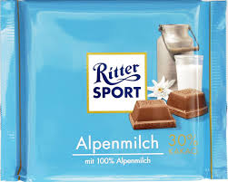

---
output:
  xaringan::moon_reader:
    lib_dir: libs
    css: [default, hygge, xaringan-themer.css]
    seal: false
    nature:
      beforeInit: "https://platform.twitter.com/widgets.js"
      highlightStyle: github
      highlightLines: true
      countIncrementalSlides: false
---

class: inverse, left, bottom
background-image: url(images_for_lecture/data_viz_william_iven_unsplash.jpg)
background-size: cover

# .Large[Data Visualization]

## .small[Welcome]
#### .tiny[Dr. Evangeline Reynolds | DS4IR | 2020-01-13 |Image credit: William Iven, Upsplash]


???

Title slide


```{r, echo = F}
doc_type <- "pres"
```

```{r xaringan-themer, include = FALSE}
library(xaringanthemer)


xaringanthemer::mono_light(
  base_color = "#4c5253",
  header_font_google = google_font("Josefin Sans"),
  text_font_google   = google_font("Montserrat", "200", "200i"),
  code_font_google   = google_font("Droid Mono"),
  text_font_size = ".85cm",
  code_font_size = ".35cm")
  
```

```{r, echo = F}
knitr::opts_chunk$set(message = F, warning = F, comment = "", fig.height = 4.5, echo = F)
```


<!--  -->

---

# Agenda

- Welcome
- Introductions
- Course expectations
- The Promise of Data Visualization and Grammar of Graphics w/ ggplot 2

---


<!-- Quadratisch. Praktisch. Gut  Je suis un artist -->


<!-- --- -->

<!--  -->


---


Function of Data Viz:

"The simple graph has brought more information to the data analyst’s mind than any other device" 


---

# Use *visual channels* to communicated information

- "pre-attentive processing"


---

## Key Aesthetics:


```{r}
knitr::include_graphics("images_for_lecture/common-aesthetics-1.png")
```


"Patterns are identified with Pre-attentive processing" 


---


# definition of a data visualization...


---


# A data visualization is made up of ...

--

### .left[... geometric objects ...]

--

### .center[...that take on aesthetics (color, line width, x-position) ...]

--

### .center[...which represent variables ...]

--

### .right[...from a dataset (dataframe)]


---

# The "Grammar of Graphics" - 1999 

```{r, out.width="40%"}
knitr::include_graphics("images_for_lecture/wilkinson_grammar_of_graphics.png")
```


---

## Elements of the Grammar of Graphics (choices)

```{r}
knitr::include_graphics("images_for_lecture/wilkinson_layers_grammar_of_graphics.png")
```

---

### A series of choices:

- choose data
--

- choose aesthetic mapping (what aesthetics will represent what variables)

--
- choose geometric objects

--
- make decision to facet or not

--
- make choice to summarize data or not (statistics)

--
- choose a coordinate system

--
- make thematic choices


---

# Implementations


# Tableau 

Polaris -> Tableau - Acquired for 15.7 Billion dollars (salesforce)

--

# Vega Lite... (dynamic, interactive data visualizations in web browsers)


--

# ggplot2 (in R)


---
class: center, middle
# Prep for Demo

https://www.youtube.com/embed/jbkSRLYSojo?list=PL6F8D7054D12E7C5A

# Hans Rosling

<iframe width="767" height="431" src="https://www.youtube.com/embed/jbkSRLYSojo?list=PL6F8D7054D12E7C5A" frameborder="0" allow="accelerometer; autoplay; encrypted-media; gyroscope; picture-in-picture" allowfullscreen></iframe>

https://www.youtube.com/embed/jbkSRLYSojo?list=PL6F8D7054D12E7C5A

---

What are the variables that are represented in the data vizualization?

--

What are the *aesthetics* (visual channels) are used to represent variables?

--

What are the aesthetic mappings (variable  <-> aesthetic pairings)

--


---


