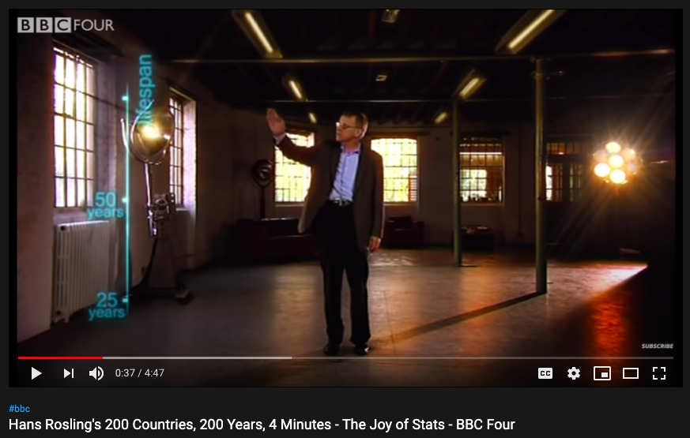
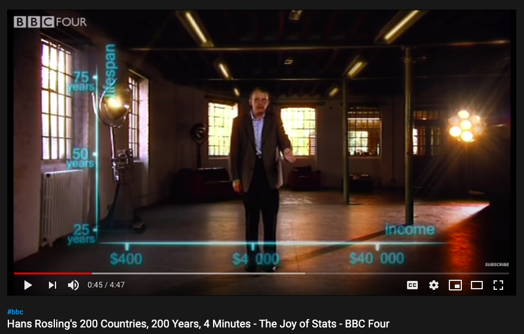
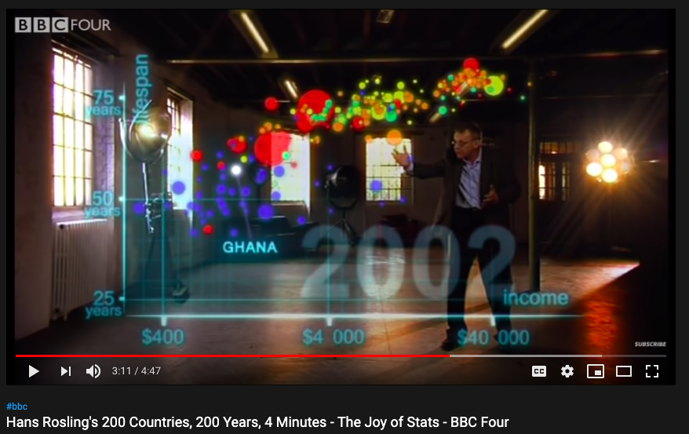
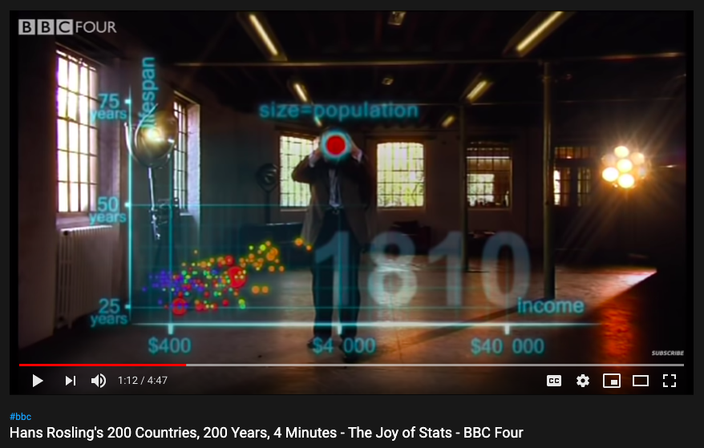
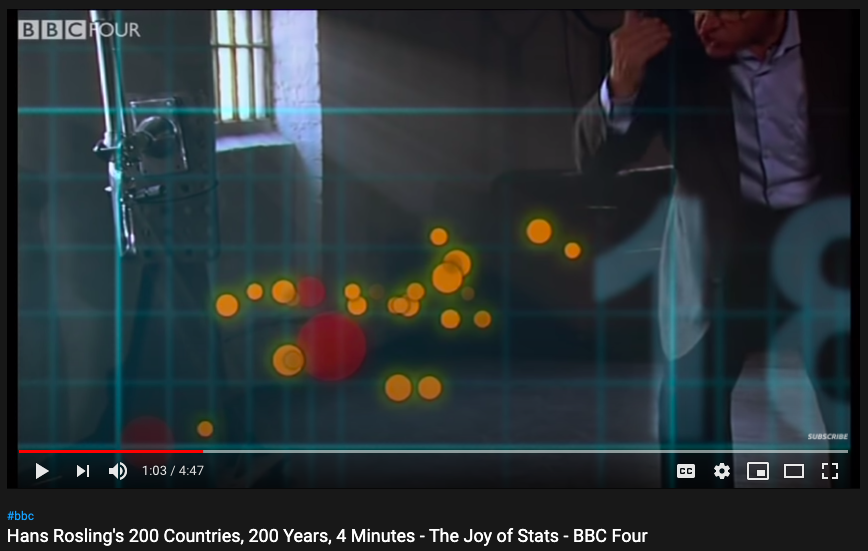

```{r, include = F}
knitr::opts_chunk$set(echo = F, comment = "", message = F, 
                      warning = F, cache = T, fig.retina = 3)
library(tidyverse)
# remotes::install_github("EvaMaeRey/)
library(flipbookr)
library(xaringanthemer)

xaringanthemer::mono_light(
  base_color = "#02075D",
  # header_font_google = google_font("Josefin Sans"),
  # text_font_google   = google_font("Montserrat", "200", "200i"),
  # code_font_google   = google_font("Droid Mono"),
  text_font_size = ".85cm",
  code_font_size = ".15cm")

my_theme <- theme_get() + theme(text = element_text(size = 20))
theme_set(my_theme)
```


class: right, top, inverse
background-image: url(https://images.unsplash.com/photo-1535016120720-40c646be5580?ixid=MXwxMjA3fDB8MHxwaG90by1wYWdlfHx8fGVufDB8fHw%3D&ixlib=rb-1.2.1&auto=format&fit=crop&w=1050&q=80)
background-size: cover

# .Large[Code movies (flipbooks) companion to MA206 Tidyverse Tutorial]

<br><br><br><br><br><br><br><br>


## Evangeline "Gina" Reynolds, Dean Data Cell & MATH!


#### Jan 14, 2021


#### https://evamaerey.github.io/ma206_tidyverse_code_movies/

#### Photo credit: Alex Litvin

???

Title slide


---

# Why are we using the tidyverse?

---

# or the Hadley Wickham tool kit...

--

> ## I build tools (computational and *cognitive*) that make data science ... --easier,-- faster,--and more fun.


---
class: inverse, middle, center
background-image: url(https://images.unsplash.com/photo-1587654780291-39c9404d746b?ixid=MXwxMjA3fDB8MHxwaG90by1wYWdlfHx8fGVufDB8fHw%3D&ixlib=rb-1.2.1&auto=format&fit=crop&w=1500&q=80)
background-size: contain

<br>

#  sequential and incremental


---


## Successful *communication* w/ sequentialism and incrementalism:


# [Hans Rosling's 200 Countries, 200 Years, 4 Minutes - The Joy of Stats - BBC Four](https://www.youtube.com/watch?v=jbkSRLYSojo)


https://www.youtube.com/watch?v=jbkSRLYSojo


???

### organization that flows and is slow = breaks everything down. 


---



---


---




---



---



---
class: inverse, center, middle

# "Having the data is not enough.  You have to show the data in ways that people *enjoy* and understand" - Hans Rosling

---

# When *code* is sequential and incremental (like in the tidyverse):

--

# We can make flipbooks (code movies)!  

---

# When *code* is sequential and incremental (like in the tidyverse):


# Conner can make flipbooks (code movies)!  

--

## pull code apart 

--

## and peice together again

--

## and watch the step-by-step code movie!

---

# MA206 Tidyverse code movies:

https://evamaerey.github.io/ma206_tidyverse_code_movies

---

# Did you notice any 'weird' syntax?

--

# Yup.


---


## Aim for incremental, sequential workflow, *where feedback is given at each step*

--

- ### What the new code means for the output

--

- ### Digestible changes to code and output


---
class: inverse, middle
background-image: url(figures/upsplash_yancy_min_snail.jpg)
background-size: cover


# **S**LOW ggplot2


---


---


# from some ggplot documentation

# '+ is the key to constructing sophisticated ggplot2 graphics. It allows you to start simple, then get more and more complex, **checking your work at each step.**

--

# slow ggplow -> more '+'


---

`r flipbookr::chunk_reveal("fast_ggplot", break_type = 1, title = "### Really fast")`


```{r fast_ggplot, include = F}
library(gapminder)
gapminder %>% 
  filter(year == 2002) %>% 
  mutate(pop_millions = pop/1000000) ->
gapminder_2002

ggplot(data = gapminder_2002, 
       aes(x = gdpPercap, 
           y = lifeExp, 
           color = continent,
           size = pop_millions)) +
  geom_point() +
  labs(x = "Income (US$)",
       y = "Life Expectancy",
       title = "Life Expectancy v. Income in 2002\nacross 142 countries",
       color = NULL,
       size = "Population") + 
  scale_x_log10() +
  theme_minimal(base_size = 20)
```


---


`r flipbookr::chunk_reveal("fast_ggplot", title = "### normal ggplot (fast), flipbooked")`


---

`r flipbookr::chunk_reveal("slow", title = " Slow ggplot, flipbooked")`


```{r slow, include = F}
library(gapminder)
gapminder %>% 
  filter(year == 2002) ->
gapminder_2002

ggplot(data = gapminder_2002) + 
  aes(x = gdpPercap) + 
  aes(y = lifeExp) + 
  geom_point() +
  aes(color = continent) + 
  aes(size = pop) +
  labs(x = "Income (US$)") +
  labs(y = "Life Expectancy") +
  labs(title = "Life Expectancy v. Income in 2002\nacross 142 countries") +
  labs(color = NULL) +
  labs(size = "Population") + 
  scale_x_log10() +
  theme_minimal(base_size = 20)
```


---

# Big thanks Conner, for translating the guide! 


<!-- { width=10% } -->


---


# These slides and most code-movies are made with {xaringan}. See how my slides were built with {xaringan}, the {tidyverse} and {flipbookr} [here](https://evamaerey.github.io/talks/ma_206_tidyverse_tutorial_code_movies_double_crochet.html) and [here](https://github.com/EvaMaeRey/talks/ma_206_tidyverse_tutorial_code_movies_double_crochet.Rmd) and learn more about {xaringan} [here](https://slides.yihui.org/xaringan/#1) 


```{css, eval = TRUE, echo = F}
.remark-code{line-height: 1.5; font-size: 100%}
```


