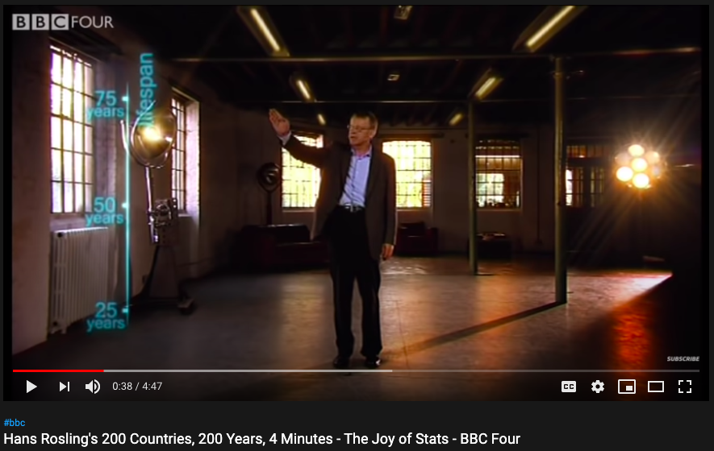
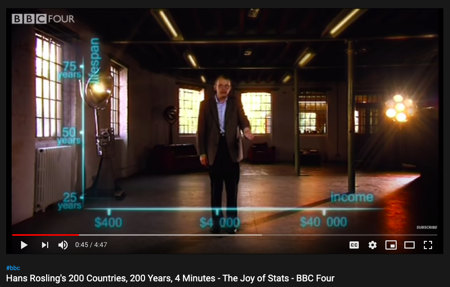
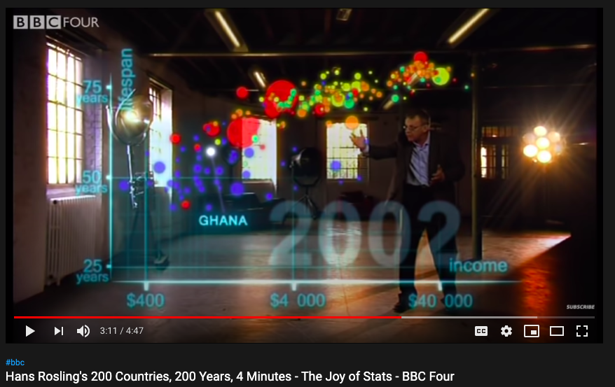

---
class: inverse

###From source .Rmd:

 ```{r, comment = '', echo = F, return = 'asis'}
cat('---
title: "MA 206 Tidyverse Tutorials"\nsubtitle: "with {flipbookr}"  \nauthor: "Evangeline \'Gina\' Reynolds"\ndate: \'Jan, 2021\'\noutput:\n  xaringan::moon_reader:\n    lib_dir: libs\n    seal: false\n    nature:\n      ratio: 16:10\n      highlightStyle: github\n      highlightLines: true\n      countIncrementalSlides: false\n      beforeInit: "https://platform.twitter.com/widgets.js"')
```


---
class: inverse

###From source .Rmd:

 ```{r, comment = '', echo = F, return = 'asis'}
cat('---
\n\n```{r, include = F}\nknitr::opts_chunk$set(echo = F, comment = "", message = F, \n                      warning = F, cache = T, fig.retina = 3)\nlibrary(tidyverse)\n# remotes::install_github("EvaMaeRey/)\nlibrary(flipbookr)\nlibrary(xaringanthemer)\n\nxaringanthemer::mono_light(\n  base_color = "#02075D",\n  # header_font_google = google_font("Josefin Sans"),\n  # text_font_google   = google_font("Montserrat", "200", "200i"),\n  # code_font_google   = google_font("Droid Mono"),\n  text_font_size = ".85cm",\n  code_font_size = ".15cm")\n\nmy_theme <- theme_get() + theme(text = element_text(size = 20))\ntheme_set(my_theme)\n```\n\n\n\n\nclass: right, top, inverse\nbackground-image: url(https://images.unsplash.com/photo-1535016120720-40c646be5580?ixid=MXwxMjA3fDB8MHxwaG90by1wYWdlfHx8fGVufDB8fHw%3D&ixlib=rb-1.2.1&auto=format&fit=crop&w=1050&q=80)\nbackground-size: cover\n\n# .Large[Code movies (flipbooks) companion to MA206 Tidyverse Tutorial]\n\n<br><br><br><br><br><br><br><br>\n\n\n## Evangeline "Gina" Reynolds, Dean Data Cell & MATH!\n\n\n#### Jan 14, 2021\n\n\n#### https://evamaerey.github.io/ma206_tidyverse_code_movies/\n\n#### Photo credit: Alex Litvin\n\n???\n\nTitle slide\n\n')
```
---


```{r, include = F}
knitr::opts_chunk$set(echo = F, comment = "", message = F, 
                      warning = F, cache = T, fig.retina = 3)
library(tidyverse)
# remotes::install_github("EvaMaeRey/)
library(flipbookr)
library(xaringanthemer)

xaringanthemer::mono_light(
  base_color = "#02075D",
  # header_font_google = google_font("Josefin Sans"),
  # text_font_google   = google_font("Montserrat", "200", "200i"),
  # code_font_google   = google_font("Droid Mono"),
  text_font_size = ".85cm",
  code_font_size = ".15cm")

my_theme <- theme_get() + theme(text = element_text(size = 20))
theme_set(my_theme)
```


class: right, top, inverse
background-image: url(https://images.unsplash.com/photo-1535016120720-40c646be5580?ixid=MXwxMjA3fDB8MHxwaG90by1wYWdlfHx8fGVufDB8fHw%3D&ixlib=rb-1.2.1&auto=format&fit=crop&w=1050&q=80)
background-size: cover

# .Large[Code movies (flipbooks) companion to MA206 Tidyverse Tutorial]

<br><br><br><br><br><br><br><br>


## Evangeline "Gina" Reynolds, Dean Data Cell & MATH!


#### Jan 14, 2021


#### https://evamaerey.github.io/ma206_tidyverse_code_movies/

#### Photo credit: Alex Litvin

???

Title slide


---
class: inverse

###From source .Rmd:

 ```{r, comment = '', echo = F, return = 'asis'}
cat('---
\n# Why are we using the tidyverse?\n')
```
---

# Why are we using the tidyverse?


---
class: inverse

###From source .Rmd:

 ```{r, comment = '', echo = F, return = 'asis'}
cat('---
\n# or the Hadley Wickham tool kit...\n\n--\n\n> ## I build tools (computational and *cognitive*) that make data science ... --easier,-- faster,--and more fun.\n\n')
```
---

# or the Hadley Wickham tool kit...

--

> ## I build tools (computational and *cognitive*) that make data science ... --easier,-- faster,--and more fun.


---
class: inverse

###From source .Rmd:

 ```{r, comment = '', echo = F, return = 'asis'}
cat('---
class: inverse, middle, center\nbackground-image: url(https://images.unsplash.com/photo-1587654780291-39c9404d746b?ixid=MXwxMjA3fDB8MHxwaG90by1wYWdlfHx8fGVufDB8fHw%3D&ixlib=rb-1.2.1&auto=format&fit=crop&w=1500&q=80)\nbackground-size: contain\n\n<br>\n\n#  sequential and incremental\n\n\n')
```
---
class: inverse, middle, center
background-image: url(https://images.unsplash.com/photo-1587654780291-39c9404d746b?ixid=MXwxMjA3fDB8MHxwaG90by1wYWdlfHx8fGVufDB8fHw%3D&ixlib=rb-1.2.1&auto=format&fit=crop&w=1500&q=80)
background-size: contain

<br>

#  sequential and incremental


---
class: inverse

###From source .Rmd:

 ```{r, comment = '', echo = F, return = 'asis'}
cat('---
\n\n## Successful *communication* w/ sequentialism and incrementalism:\n\n\n\n\n# [Hans Rosling\'s 200 Countries, 200 Years, 4 Minutes - The Joy of Stats - BBC Four](https://www.youtube.com/watch?v=jbkSRLYSojo)\n\n\nhttps://www.youtube.com/watch?v=jbkSRLYSojo\n\n\n???\n\n### organization that flows and is slow = breaks everything down. \n\n')
```
---


## Successful *communication* w/ sequentialism and incrementalism:


# [Hans Rosling's 200 Countries, 200 Years, 4 Minutes - The Joy of Stats - BBC Four](https://www.youtube.com/watch?v=jbkSRLYSojo)


https://www.youtube.com/watch?v=jbkSRLYSojo


???

### organization that flows and is slow = breaks everything down. 


---
class: inverse

###From source .Rmd:

 ```{r, comment = '', echo = F, return = 'asis'}
cat('---
\n\n')
```
---


---
class: inverse

###From source .Rmd:

 ```{r, comment = '', echo = F, return = 'asis'}
cat('---
\n')
```
---


---
class: inverse

###From source .Rmd:

 ```{r, comment = '', echo = F, return = 'asis'}
cat('---
\n\n\n')
```
---


---
class: inverse

###From source .Rmd:

 ```{r, comment = '', echo = F, return = 'asis'}
cat('---
\n\n')
```
---


---
class: inverse

###From source .Rmd:

 ```{r, comment = '', echo = F, return = 'asis'}
cat('---
\n\n')
```
---


---
class: inverse

###From source .Rmd:

 ```{r, comment = '', echo = F, return = 'asis'}
cat('---
class: inverse, center, middle\n\n# "Having the data is not enough.  You have to show the data in ways that people *enjoy* and understand" - Hans Rosling\n')
```
---
class: inverse, center, middle

# "Having the data is not enough.  You have to show the data in ways that people *enjoy* and understand" - Hans Rosling


---
class: inverse

###From source .Rmd:

 ```{r, comment = '', echo = F, return = 'asis'}
cat('---
\n# When *code* is sequential and incremental (like in the tidyverse):\n\n--\n\n# We can make flipbooks (code movies)!  \n')
```
---

# When *code* is sequential and incremental (like in the tidyverse):

--

# We can make flipbooks (code movies)!  


---
class: inverse

###From source .Rmd:

 ```{r, comment = '', echo = F, return = 'asis'}
cat('---
\n# When *code* is sequential and incremental (like in the tidyverse):\n\n\n\n# Conner can make flipbooks (code movies)!  \n\n--\n\n## pull code apart \n\n--\n\n## and peice together again\n\n--\n\n## and watch the step-by-step code movie!\n')
```
---

# When *code* is sequential and incremental (like in the tidyverse):


# Conner can make flipbooks (code movies)!  

--

## pull code apart 

--

## and peice together again

--

## and watch the step-by-step code movie!


---
class: inverse

###From source .Rmd:

 ```{r, comment = '', echo = F, return = 'asis'}
cat('---
\n# MA206 Tidyverse code movies:\n\nhttps://evamaerey.github.io/ma206_tidyverse_code_movies\n')
```
---

# MA206 Tidyverse code movies:

https://evamaerey.github.io/ma206_tidyverse_code_movies


---
class: inverse

###From source .Rmd:

 ```{r, comment = '', echo = F, return = 'asis'}
cat('---
\n# Did you notice any \'weird\' syntax?\n\n--\n\n# Yup.\n\n')
```
---

# Did you notice any 'weird' syntax?

--

# Yup.


---
class: inverse

###From source .Rmd:

 ```{r, comment = '', echo = F, return = 'asis'}
cat('---
\n\n## Aim for incremental, sequential workflow, *where feedback is given at each step*\n\n--\n\n- ### What the new code means for the output\n\n--\n\n- ### Digestible changes to code and output\n\n\n\n')
```
---


## Aim for incremental, sequential workflow, *where feedback is given at each step*

--

- ### What the new code means for the output

--

- ### Digestible changes to code and output


---
class: inverse

###From source .Rmd:

 ```{r, comment = '', echo = F, return = 'asis'}
cat('---
class: inverse, middle\nbackground-image: url(figures/upsplash_yancy_min_snail.jpg)\nbackground-size: cover\n\n\n# **S**LOW ggplot2\n\n\n')
```
---
class: inverse, middle
background-image: url(figures/upsplash_yancy_min_snail.jpg)
background-size: cover


# **S**LOW ggplot2


---
class: inverse

###From source .Rmd:

 ```{r, comment = '', echo = F, return = 'asis'}
cat('---
\n\n# from some ggplot documentation\n\n# \'+ is the key to constructing sophisticated ggplot2 graphics. It allows you to start simple, then get more and more complex, **checking your work at each step.**\n\n--\n\n# slow ggplow -> more \'+\'\n\n\n')
```
---


# from some ggplot documentation

# '+ is the key to constructing sophisticated ggplot2 graphics. It allows you to start simple, then get more and more complex, **checking your work at each step.**

--

# slow ggplow -> more '+'


---
class: inverse

###From source .Rmd:

 ```{r, comment = '', echo = F, return = 'asis'}
cat('---
\n`r flipbookr::chunk_reveal("fast_ggplot", break_type = 1, title = "### Really fast")`\n\n\n```{r fast_ggplot, include = F}\nlibrary(gapminder)\ngapminder %>% \n  filter(year == 2002) %>% \n  mutate(pop_millions = pop/1000000) ->\ngapminder_2002\n\nggplot(data = gapminder_2002, \n       aes(x = gdpPercap, \n           y = lifeExp, \n           color = continent,\n           size = pop_millions)) +\n  geom_point() +\n  labs(x = "Income (US$)",\n       y = "Life Expectancy",\n       title = "Life Expectancy v. Income in 2002\nacross 142 countries",\n       color = NULL,\n       size = "Population") + \n  scale_x_log10() +\n  theme_minimal(base_size = 20)\n```\n\n')
```
---

`r flipbookr::chunk_reveal("fast_ggplot", break_type = 1, title = "### Really fast")`


```{r fast_ggplot, include = F}
library(gapminder)
gapminder %>% 
  filter(year == 2002) %>% 
  mutate(pop_millions = pop/1000000) ->
gapminder_2002

ggplot(data = gapminder_2002, 
       aes(x = gdpPercap, 
           y = lifeExp, 
           color = continent,
           size = pop_millions)) +
  geom_point() +
  labs(x = "Income (US$)",
       y = "Life Expectancy",
       title = "Life Expectancy v. Income in 2002\nacross 142 countries",
       color = NULL,
       size = "Population") + 
  scale_x_log10() +
  theme_minimal(base_size = 20)
```


---
class: inverse

###From source .Rmd:

 ```{r, comment = '', echo = F, return = 'asis'}
cat('---
\n\n`r flipbookr::chunk_reveal("fast_ggplot", title = "### normal ggplot (fast), flipbooked")`\n\n\n')
```
---


`r flipbookr::chunk_reveal("fast_ggplot", title = "### normal ggplot (fast), flipbooked")`


---
class: inverse

###From source .Rmd:

 ```{r, comment = '', echo = F, return = 'asis'}
cat('---
\n`r flipbookr::chunk_reveal("slow", title = " Slow ggplot, flipbooked")`\n\n\n```{r slow, include = F}\nlibrary(gapminder)\ngapminder %>% \n  filter(year == 2002) ->\ngapminder_2002\n\nggplot(data = gapminder_2002) + \n  aes(x = gdpPercap) + \n  aes(y = lifeExp) + \n  geom_point() +\n  aes(color = continent) + \n  aes(size = pop) +\n  labs(x = "Income (US$)") +\n  labs(y = "Life Expectancy") +\n  labs(title = "Life Expectancy v. Income in 2002\nacross 142 countries") +\n  labs(color = NULL) +\n  labs(size = "Population") + \n  scale_x_log10() +\n  theme_minimal(base_size = 20)\n```\n\n\n\n\n\n')
```
---

`r flipbookr::chunk_reveal("slow", title = " Slow ggplot, flipbooked")`


```{r slow, include = F}
library(gapminder)
gapminder %>% 
  filter(year == 2002) ->
gapminder_2002

ggplot(data = gapminder_2002) + 
  aes(x = gdpPercap) + 
  aes(y = lifeExp) + 
  geom_point() +
  aes(color = continent) + 
  aes(size = pop) +
  labs(x = "Income (US$)") +
  labs(y = "Life Expectancy") +
  labs(title = "Life Expectancy v. Income in 2002\nacross 142 countries") +
  labs(color = NULL) +
  labs(size = "Population") + 
  scale_x_log10() +
  theme_minimal(base_size = 20)
```


---
class: inverse

###From source .Rmd:

 ```{r, comment = '', echo = F, return = 'asis'}
cat('---
\n# Big thanks Conner Surrency, for translating the guide! \n\n\n\n')
```
---

# Big thanks Conner Surrency, for translating the guide! 


---
class: inverse

###From source .Rmd:

 ```{r, comment = '', echo = F, return = 'asis'}
cat('---
\n\n# These slides and most code-movies are made with {xaringan}. Learn more about {xaringan} [here](https://slides.yihui.org/xaringan/#1) and see how these slides were built [here]().\n\n\n\n```{css, eval = TRUE, echo = F}\n.remark-code{line-height: 1.5; font-size: 100%}\n```\n\n')
```
---


# These slides and most code-movies are made with {xaringan}. Learn more about {xaringan} [here](https://slides.yihui.org/xaringan/#1) and see how these slides were built [here]().


```{css, eval = TRUE, echo = F}
.remark-code{line-height: 1.5; font-size: 100%}
```


